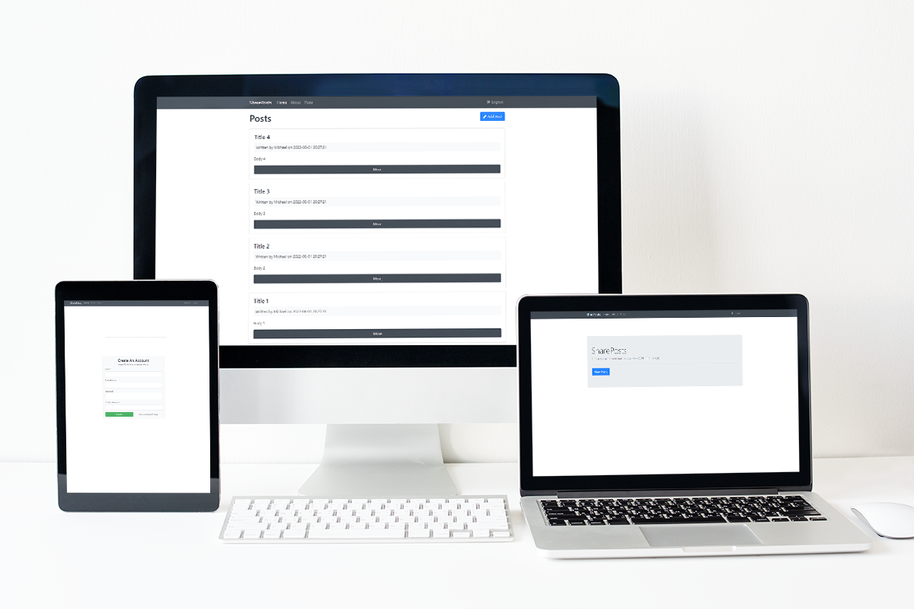
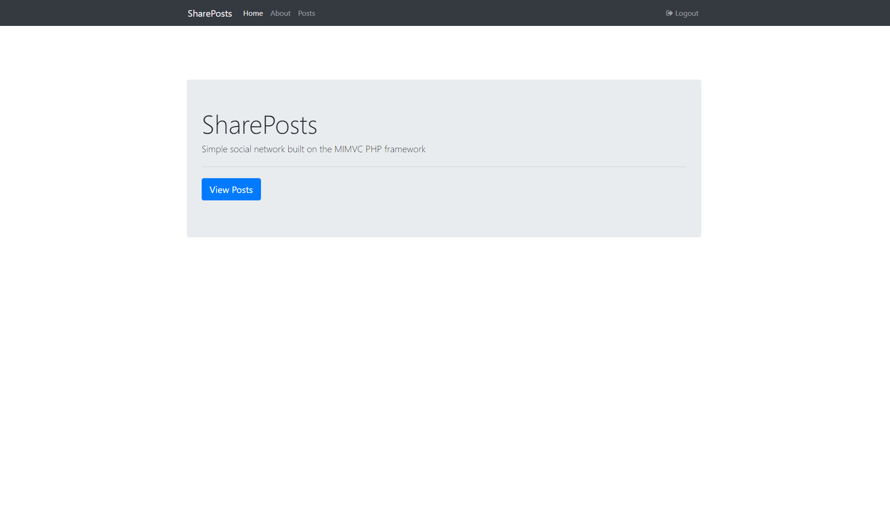
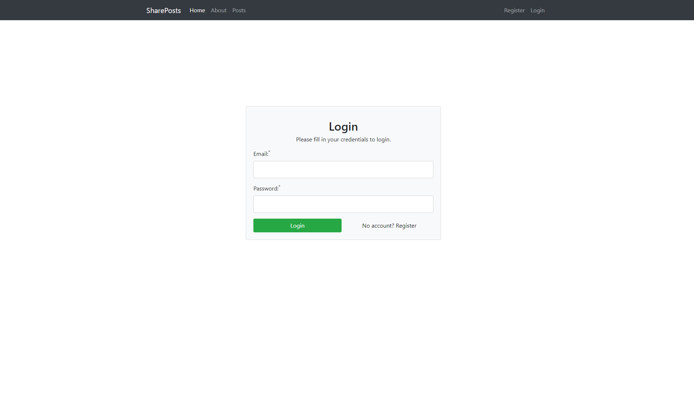
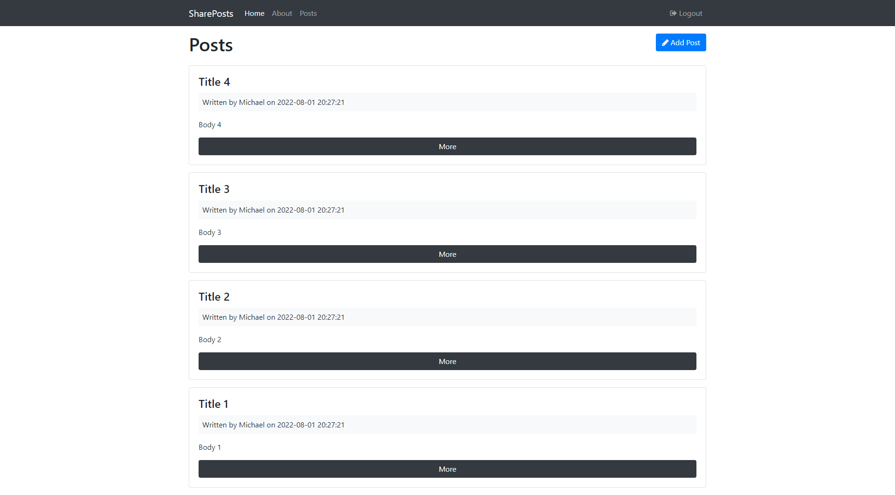
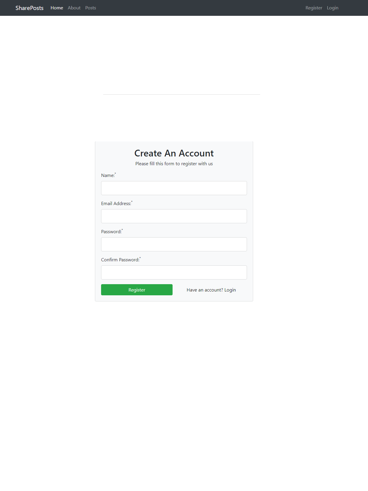

<h3 align="center">Shareposts — Application build using Custom PHP Framework with OOP PHP</h3>

> This is the Localhost Edition of this project

<h1 align="center">
 
</h1>

# Table of Contents

- [Table of Contents](#table-of-contents)
- [Introduction](#introduction)
  - [Features](#features)
- [Project Structure](#project-structure)
- [Instructions for running locally](#instructions-for-running-locally)
  - [MySQL Database Setup](#mysql-database-setup)
- [Application Images](#application-images)
- [Hosting on a Web Server](#hosting-on-a-web-server)

# Introduction

Shareposts is a Blogging System (CMS) with all the below features. The application is built without using any PHP framework such as Codeigniter or Laravel but instead is a custom simplistic framework and uses the application uses a MySQL database for storage for the two models `User` and `Posts` functionality.

Server Configuration files (`.htaccess`) are included to enable hosting on a webserver by assigning correct path mapping.

---

## Features

- [x] User Authentication
  - [x] Login
  - [x] Register
- [x] Flash Messages
- [x] CRUD Functionality
  - [x] Create Posts
  - [x] Read Posts
  - [x] Update and Delete your own Posts

---

# Project Structure

```php
shareposts-localhost
├── app                         # Application, MVC Structure, Libries, Config file
|   ├── config                  # Database Parameters
|   |   └── config.php
|   ├── controllers
|   |   └── Pages.php
|   ├── helpers                  # Redirects, Sessions, Flash Messages
|   |   ├── session_helper.php
|   |   └── url_helper.php
|   ├── libaries
|   |   ├── Controller.php      # Load Models and Views
|   |   ├── Core.php            # URL routing
|   |   └── Database.php        # PDO Class, Database Methods (Model works with this file)
|   ├── models
|   |   └── Post.php            # Post Model -> Example model to get you started with interacting with the Database
|   ├── views
|   |   ├── includes
|   |   |   ├── footer.php
|   |   |   └── header.php
|   |   └── pages
|   |       ├── about.php
|   |       └── index.php
|   ├── .htaccess               # logic to hide files & folders within this directory
│   └── bootstrap.php           # requires all the libaries, config file, helpers etc.
├── public                      # front of the application, index.php, htaccess file rules (routing), static assets (JS,CSS etc)
|   ├── css
|   |   └── style.css
|   ├── controllers
|   |   └── main.js
|   ├── .htaccess               # direct everything through the index.php
│   └── index.php
└── .htaccess

```

# Instructions for running locally

- In `C:\xampp\htdocs\` clone this repo
- Open `http://localhost/shareposts-localhost/` in your browser.
  - This is the location configured to serve the application (your local server) in `URLROOT` within `app/config/config.php` and the `.htaccess` file within the `public` directory.

## MySQL Database Setup

- Power on Apache and MySQL via the XAMPP Control Panel & click `Admin` under MySQL
- Import `shareposts.sql` into MySQL phpMyAdmin under `import/file`
- Alternatively create the database and tables by following the steps below:
  - Create database in MySQL `shareposts`
    - Ensure the `username` is root and password is '' (empty) otherwise update these in the `app.config/config.php` file.
    - Create `users` table using the sql query:
      - `create table if not exists posts ( id int auto_increment primary key, user_id int not null, title varchar(255) not null, body varchar(255) not null, created_at datetime default CURRENT_TIMESTAMP not null );`
    - Create `posts` table using the sql query:
      - `create table if not exists users ( id int auto_increment primary key, name varchar(255) not null, password varchar(255) not null, email varchar(255) not null, created_at datetime default CURRENT_TIMESTAMP not null );`
- Application should now be running successfully

# Application Images

<h1 align="center"> 
 
 
 
 
</h1>

# Hosting on a Web Server

> Useful Links to assist you

- [What is the .htaccess File?](https://ithemes.com/blog/what-is-the-htaccess-file/#:~:text=htaccess%20file%20is%20a%20powerful,to%20edit%20server%20configuration%20files.)
- [Heroku ](https://devcenter.heroku.com/articles/custom-php-settings)
- [Apache HTTP Server Tutorial: .htaccess files](https://httpd.apache.org/docs/2.4/howto/htaccess.html)
